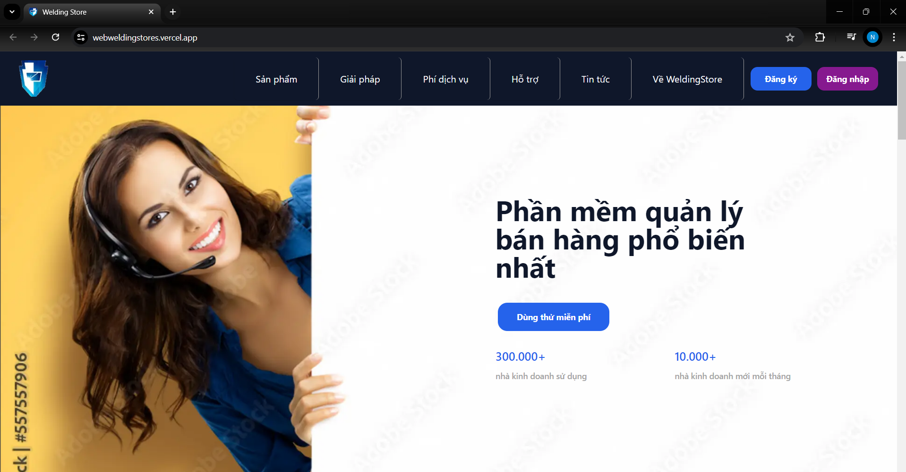
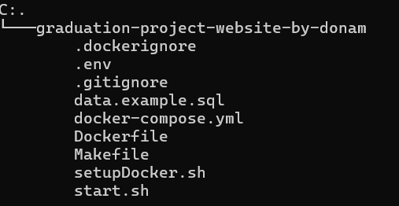

# Rental Sales Management Services Platform
## Hi, I'm Nam IT! 👋
Welcome to the Rental Sales Management Platform repository! This project focuses on delivering a robust Software as a Service (SaaS) solution tailored for efficient rental and sales management. Powered by Next.js, our platform emphasizes SEO best practices and optimized website performance.

## Tech Stack

**Client:** NextJs, TailwindCSS, Firebase

**Server:** NextJs, Node, Express, Stripe, Prisma

**Database:** Postgres


**Deploy Tools:** Vercel, Docker


## Features
- SaaS Model: Provides a scalable solution for managing rental operations and sales processes.

- Next.js Framework: Utilizes Next.js for server-side rendering (SSR), enhancing SEO capabilities and delivering fast-loading web pages.

- SEO Optimization: Implements SEO best practices to improve search engine visibility and attract organic traffic.

- Performance Optimization: Optimizes website performance through efficient code structure, image optimization, and server-side rendering.

## Getting Started

### How to set up the project directory from github

Clone the project

```bash
  git clone https://github.com/DoNhatNam1/graduation-project-website-by-donam.git
```

Go to the project directory

```bash
  cd graduation-project-website-by-donam
```

Install dependencies

```bash
  npm ci
```

Environment Variables

To run this project, you will need to add the following environment variables to your .env file from .env.development file

`POSTGRES_PRISMA_URL`

`POSTGRES_URL_NON_POOLING`

. . . .

You can read this [Documentation](https://www.prisma.io/docs/getting-started/setup-prisma/add-to-existing-project/relational-databases/connect-your-database-typescript-postgresql) or watch this [YouTube](https://www.youtube.com/watch?v=_ER9jHiylAo) to setup the prisma database environment in nextjs

Run on Development

```bash
  npm run dev
```

Build on Production

```bash
  npm run build
```

Start the web

```bash
  npm run start
```

 ## How to set up the project from Docker

You don't need to clone the project if you follow this setup, just setup Docker in Linux or SubLinux, follow this [Linux_On_Window](https://www.howtogeek.com/744328/how-to-install-the-windows-subsystem-for-linux-on-windows-11/) or you can watch [Youtube_Docker_Setup_On_Window](https://www.youtube.com/watch?v=rATNU0Fr8zs) or follow the below introduction:

 #### First you need to copy all the folder and file to your computer, like this: 

- Linux: Run the script as root (sudo) to install Docker on Linux.

```bash
sudo bash setupDocker.sh
```

- macOS: Run script on macOS Terminal.

```bash
bash setupDocker.sh
```

- Windows: Run script in WSL 2 environment (must be installed previously).

```bash
bash setupDocker.sh
```

## Installation

Install Make in PowerShell

```bash
choco install make
```

Create folder graduation-project-website-by-donam

```bash
mkdir graduation-project-website-by-donam
cd graduation-project-website-by-donam
```

Copy the all the file and folder like this



Run Docker Command from Makefile 

```bash
make start-dev
```

## Contact
For more information about the platform, please visit our website [[WeldingStore](https://webweldingstores.vercel.app/)] or contact us at namnhatvt2003@gmail.com.

## License

[MIT](https://choosealicense.com/licenses/mit/)